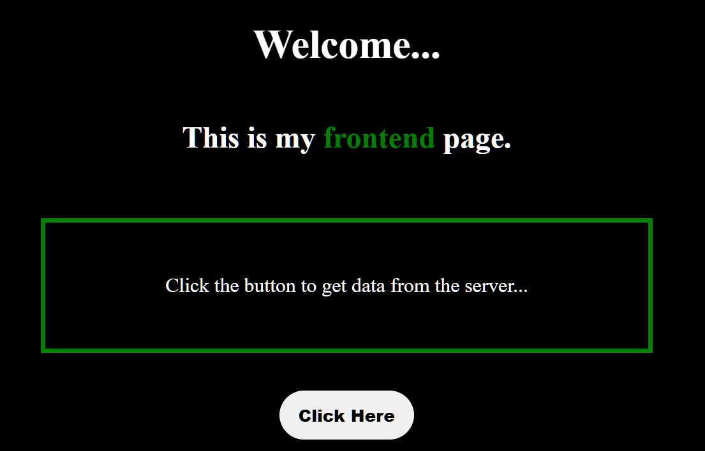
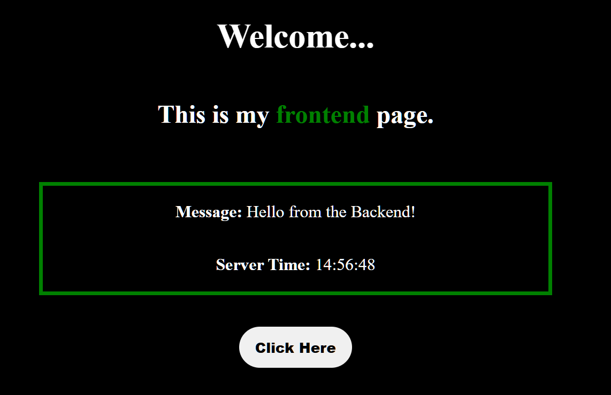

# 🌐 Basic Node.js Backend Server 🚀

A simple project to demonstrate how a **frontend communicates with a backend server** using Node.js.

Click a button on the frontend and receive data (message + time) from the backend ⚡

---

## ✨ Features

* ⚙️ Backend using Node.js (HTTP module)
* 🎨 Frontend using HTML, CSS, JavaScript
* 🔁 Fetch API for communication
* 🖱️ Button click triggers API request
* ⏱️ Displays server message and time

---

## ⚙️ How It Works

1️⃣ Frontend sends request to backend
2️⃣ Backend creates a JSON response:

* Message: `"Hello from the Backend!"`
* Timestamp: current server time
  3️⃣ Data is sent back to frontend
  4️⃣ Frontend displays the data on screen ✅

---

## 🚀 How to Run This Project

### 1️⃣ Clone the Repository

```bash
git clone https://github.com/Saksham-Sharma-webdev/Basic-NodeJS-Server
```

### 2️⃣ Go to Project Folder

```bash
cd "Basic NodeJS Server"
```

---

### 3️⃣ Start the Backend Server

```bash
cd Backend
node server.js
```

👉 Server runs at: **http://127.0.0.1:3000**

---

### 🌍 Open the Frontend

📂 Go to the `Frontend` folder

🖱️ Open `index.html` in your browser

👉 OR (Recommended ⚡)

💻 Use **Live Server** in VS Code:

* Right click on `index.html`
* Click **"Open with Live Server"**


---

### ⚠️ Important

* Make sure backend server is running ✅
* Otherwise frontend will not get data ❌

---

## 📸 Screenshots




## ⭐ Support

If you found this project helpful, please consider giving it a star ⭐ on GitHub!

---

**Made with ❤️ using JavaScript 🚀**
